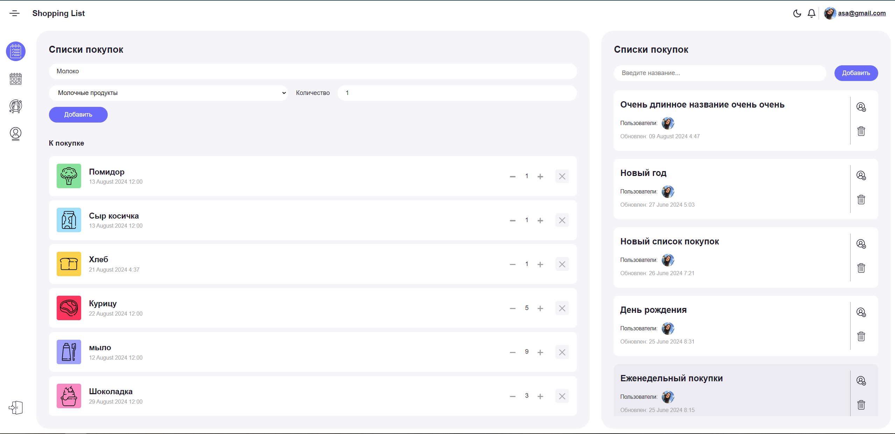

<h1>Приложение список покупок</h1>

## Технологии


<div align="center">
  
</div>

## Запуск проекта:
* Склонировать проект на ваш компьютер с Github с помощью команды:
```
git clone https://github.com/AgentC84/shopping-list.git
```

* Установить зависимости с помощью команды:
```
npm install
```
* Создать файл для подключения к Firebase:
 Согласно документации
  
* Запустить проект с помощью команды:
```
npm start
```
